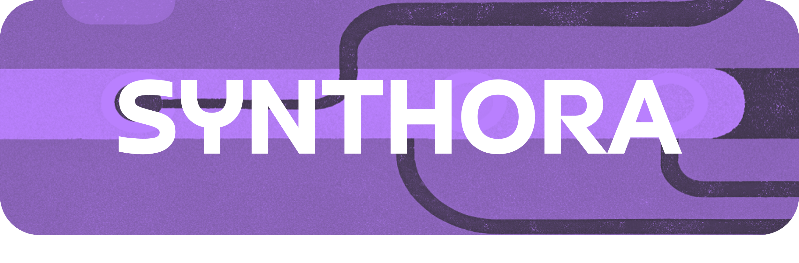

<!-- LICENSE HEADER MANAGED BY add-license-header

Copyright 2024-2025 Syntropix

Licensed under the Apache License, Version 2.0 (the "License");
you may not use this file except in compliance with the License.
You may obtain a copy of the License at

    http://www.apache.org/licenses/LICENSE-2.0

Unless required by applicable law or agreed to in writing, software
distributed under the License is distributed on an "AS IS" BASIS,
WITHOUT WARRANTIES OR CONDITIONS OF ANY KIND, either express or implied.
See the License for the specific language governing permissions and
limitations under the License.
-->

<div align="center">
    
</div>

<div align="center">
<a href="https://github.com/syntropix-ai/synthora/blob/main/LICENSE">
    
</a>
<a href="https://twitter.com/SyntropixAI">
    
</a>
<a href="https://www.linkedin.com/company/syntropix">
    
</a>
<a href="https://docs.syntropix.ai/">
    
</a>
<a href="https://github.com/syntropix-ai/synthora">
    
</a>
</div>

## 📖 Introduction

Synthora is a lightweight, extensible framework for LLM-driven agents and ALM research. It provides the essential components to build, test, and evaluate agents, enabling you to assemble an agent with a single configuration file. Our goal is to minimize effort while delivering robust functionality.

> **Note:** This project is in its early stage of development. The APIs are subject to significant changes, which may introduce breaking updates. Use with caution and consider the risks associated with adopting an evolving framework. We welcome your feedback and contributions to improve this project together!

## 💡 Core Features

Synthora offers a comprehensive suite of features designed to support your AI development needs:

- **Config-Driven Assembly:** Assemble agents and conduct chats with simple configurations.
- **Agents:** Includes various predefined agents (e.g., COT, TOT, ReAct) and supports custom agent creation.
- **Tools:** A comprehensive tool set is integrated for agents to call, unleashing the full power of agents.
- **Task Automation:** Employ powerful workflows to automate and streamline diverse tasks.
- **Multi-Agent Interactions:** Easily combine multiple agents using configuration files or straightforward code.
- **Extensibility:** Leverage a lightweight and highly extensible framework that integrates seamlessly with additional tools.
- **State-of-the-Art Workflows:** Align your work with cutting-edge AI research and practices.

## ⚙ Installation

Install the Synthora Python Library from PyPI with a single command:

```shell
pip install synthora
```

## ✨ Quick Start

### Chat with an Agent

Engage in a conversation with a prebuilt Vanilla Agent:

```python
from synthora.callbacks import RichOutputHandler
from synthora.agents import VanillaAgent

agent = VanillaAgent.default("You are a Vanilla Agent.", handlers=[RichOutputHandler()])
agent.run("Hi! How are you?")
```

### Define a Tool

Create a simple tool to add two numbers using the provided decorator:

```python
from synthora.toolkits.decorators import tool

@tool
def add(a: int, b: int) -> int:
    r"""Add two numbers together."""
    return a + b
```

### Build a Workflow

Construct a workflow that chains tasks together:

```python
def add(x: int, y: int) -> int:
    return x + y

flow = (BaseTask(add) | BaseTask(add)) >> BaseTask(add)
flow.run(1, 2)
```

## 📃 Documentation

For detailed information on core modules, tutorials, and cookbooks, please visit our [Documentation](https://docs.syntropix.ai/en/latest/).

## 🌎 The Ecosystem

Synthora is a core component of the **Syntropix Ecosystem**, serving as the hub for our tech stack and community engagement.


We also offer a backend API platform, **Syntropix**, which provides a low-cost, efficient CPU-accelerated inference service—the first of its kind in heterogeneous acceleration. Using Syntropix as your backend API in Synthora unlocks additional benefits:

- Detailed observability, analysis, and evaluation.
- Finer-grain control over inference services, including scheduled jobs.
- More advanced features and functionalities in the pipeline.

For further details, check out:

- [Syntropix Homepage](https://syntropix.ai/)
- [Syntropix Playground (Coming Soon)]()

## 🧠 Contributing

We’re in the early stages of Synthora’s development, and your contributions are crucial to shaping its future. Whether you're a developer, researcher, or enthusiast, your feedback and code contributions are welcome and highly valued. If you encounter issues, have ideas for enhancements, or want to contribute new features, please get involved! Check our GitHub repository for guidelines on how to contribute, submit issues, and propose pull requests.

Together, we can build a robust and innovative framework that meets the needs of the AI research community. Join us on this journey, and help shape the future of agent-driven AI!
